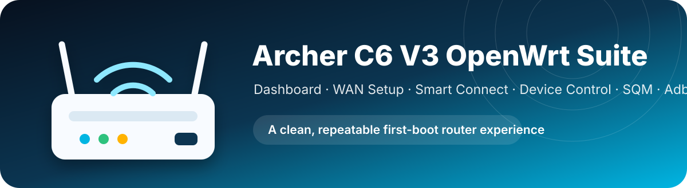
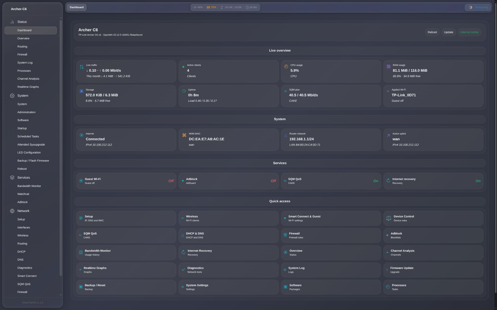
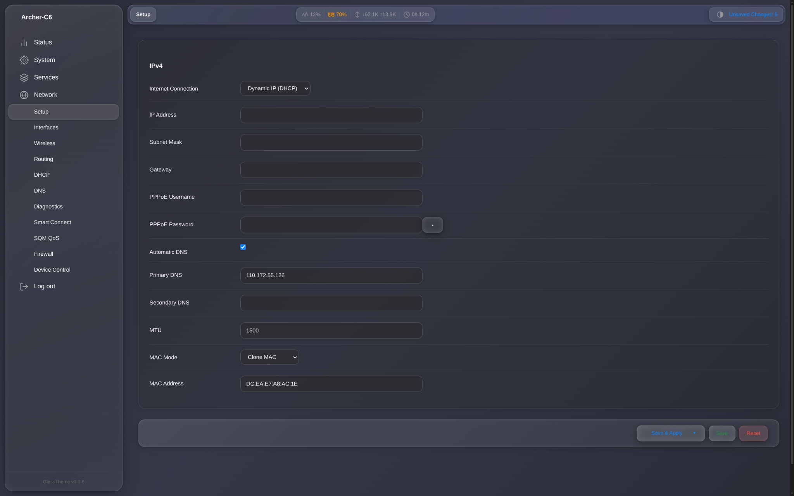
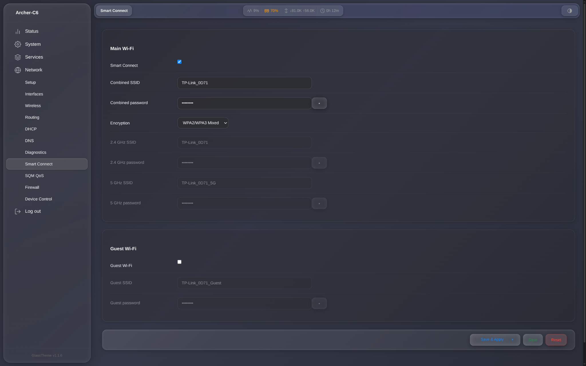
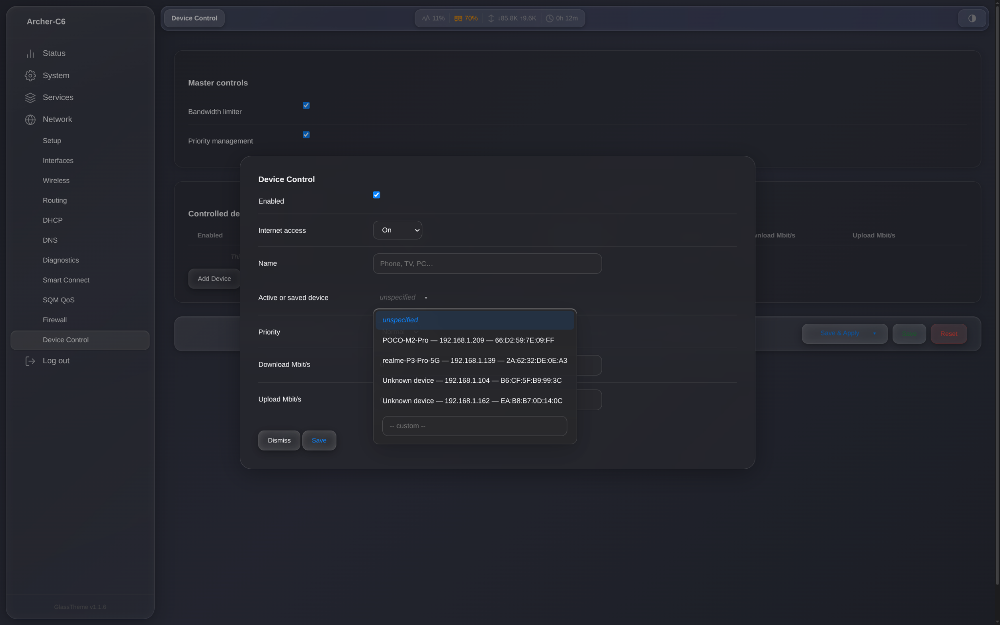
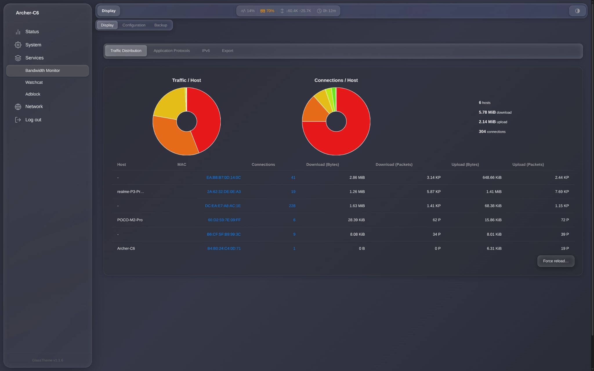
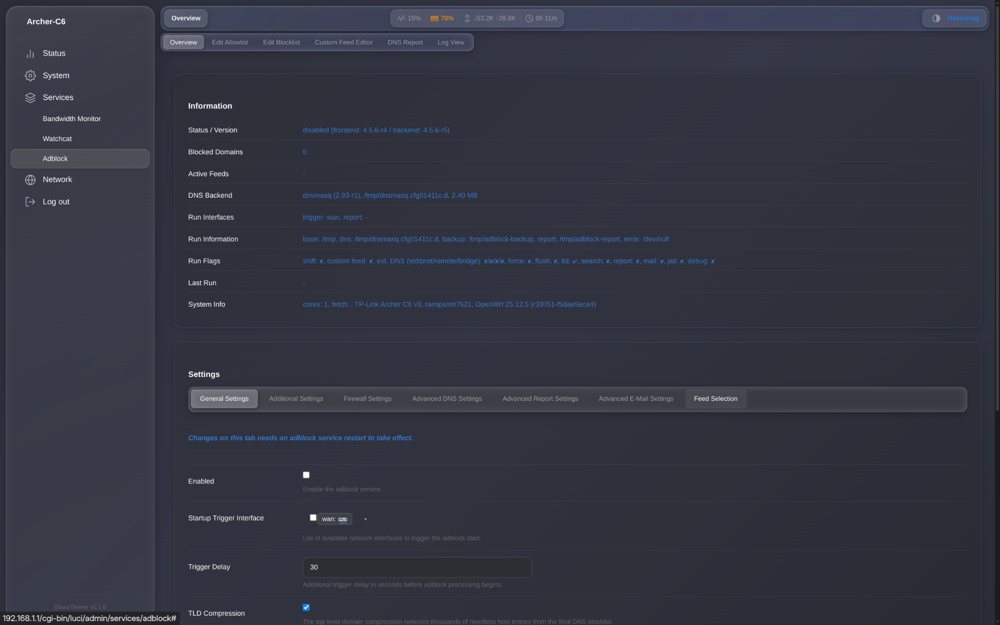

<p align="center">
  
</p>

<p align="center">
  
</p>

<p align="center">
  
  
  
  
  
</p>

<p align="center">
  A compact, GitHub-safe OpenWrt first-boot customization suite for the <strong>TP-Link Archer C6 V3</strong>.
  It adds a modern LuCI dashboard, guided WAN setup, Smart Connect-style Wi-Fi management,
  guest isolation, per-device controls, CAKE SQM, Adblock integration, recovery automation,
  and persistent monthly traffic accounting.
</p>

> [!IMPORTANT]
> This repository is device-specific. The script exits unless OpenWrt reports the board as `tplink,archer-c6-v3`.

## Screenshots

Real interface screenshots from the custom LuCI suite are shown below.

<table>
  <tr>
    <td width="50%" align="center"><strong>Dashboard</strong><br></td>
    <td width="50%" align="center"><strong>WAN Setup</strong><br></td>
  </tr>
  <tr>
    <td width="50%" align="center"><strong>Smart Connect & Guest Wi-Fi</strong><br></td>
    <td width="50%" align="center"><strong>Device Control</strong><br></td>
  </tr>
  <tr>
    <td width="50%" align="center"><strong>Bandwidth Monitor</strong><br></td>
    <td width="50%" align="center"><strong>Adblock</strong><br></td>
  </tr>
</table>

## Highlights

| Area | Included functionality |
|---|---|
| **Custom dashboard** | Live download/upload rate, monthly usage, active-client count, CPU, RAM, storage, uptime, SQM plan, applied Wi-Fi, WAN IP/MAC, service status, and quick links. |
| **Smart Connect-style Wi-Fi** | Shared or separate 2.4/5 GHz SSIDs, WPA2/WPA3 Mixed or WPA2 Personal selector, 802.11k/v assistance, and conservative `usteer` integration. |
| **Guest Wi-Fi** | Separate `192.168.30.0/24` network, DHCP, firewall isolation, client isolation, and disabled-by-default guest radios. |
| **WAN Setup page** | DHCP, Static IPv4, PPPoE, Disabled mode, automatic/manual DNS, MTU, hardware MAC, and optional MAC cloning. |
| **Device Control** | Automatic LAN-device discovery, DHCP reservation, Internet On/Paused, High/Normal/Low DSCP priority, and per-device download/upload caps. |
| **SQM / CAKE** | `layer_cake.qos`, ECN enabled, default 40.5/40.5 Mbit/s shaping, and automatic WAN-device synchronization. |
| **Traffic accounting** | `nlbwmon` monthly totals, 5-minute refresh, 1-hour persistent commit, three database generations, and upgrade preservation. |
| **Adblock** | Installed and preconfigured with `adguard` and `adguard_tracking`, but disabled by default. |
| **Recovery** | Watchcat restarts the WAN after a prolonged failure and reboots the router only after a longer failure window. |
| **Hardening** | Firewall defaults set to REJECT, SYN-flood protection, flow offloading disabled for SQM/device rules, and SSH restricted to LAN. |
| **Upgrade persistence** | Custom LuCI views, services, configuration, migration markers, and `nlbwmon` data are added to `/etc/sysupgrade.conf`. |

## How it works

The repository contains two deployment inputs:

- [`firstboot.sh`](firstboot.sh) — the custom first-boot configuration script.
- [`packages.txt`](packages.txt) — the complete package selection for an apk-based OpenWrt image.

On a clean installation, the script:

1. Verifies the exact router board.
2. Creates the Wi-Fi, guest network, firewall, Smart Connect, SQM, Adblock, Watchcat, and traffic-accounting configuration.
3. Installs custom LuCI menu entries, ACLs, JavaScript views, helper scripts, init scripts, and hotplug hooks.
4. Enables the required services and reloads the network.
5. Writes migration markers so future keep-settings upgrades do not reset the user’s configuration.

## Compatibility

| Item | Requirement / default |
|---|---|
| Router | TP-Link Archer C6 V3 |
| OpenWrt board name | `tplink,archer-c6-v3` |
| Package system | apk-based OpenWrt image |
| LuCI theme | Material |
| LAN assumption | `br-lan`, normally `192.168.1.1` |
| Country | India (`IN`) |
| Time zone | `Asia/Kolkata` |
| 2.4 GHz | Auto channel limited to 1/6/11, HT20 |
| 5 GHz | Auto channel limited to 36/40/44/48, VHT80 |
| Guest network | `192.168.30.1/24` |

> [!CAUTION]
> On its first clean application, the script removes existing `wifi-iface` sections and creates its own Wi-Fi layout. Back up the router before using it on an already-configured system.

## Public default credentials

These values are intentionally generic because the repository is public:

| Network | SSID | Password |
|---|---|---|
| Combined main Wi-Fi | `OpenWrt-Home` | `ChangeMe123!` |
| Separate 2.4 GHz | `OpenWrt-Home-2G` | `ChangeMe123!` |
| Separate 5 GHz | `OpenWrt-Home-5G` | `ChangeMe123!` |
| Guest Wi-Fi | `OpenWrt-Guest` | `ChangeMeGuest123!` |

> [!WARNING]
> Change the Wi-Fi passwords and set a strong OpenWrt root password immediately. Never deploy the public placeholder credentials unchanged on an exposed or permanent network.

No WAN clone MAC is embedded. Clean installations use the hardware MAC unless the user selects **Setup → MAC Mode → Clone MAC** and enters an address.

## Installation with OpenWrt Firmware Selector

1. Back up the current router configuration.
2. Select the exact **TP-Link Archer C6 V3** device profile.
3. Copy the complete contents of [`packages.txt`](packages.txt) into the package field.
4. Copy the complete contents of [`firstboot.sh`](firstboot.sh) into the first-boot script field.
5. Build and download the image.
6. Flash the image using the normal OpenWrt procedure for this device.
7. For a clean first installation, do not restore incompatible settings from a different firmware layout.
8. Connect to `OpenWrt-Home`, open `http://192.168.1.1/`, and complete the post-install checklist below.

The current script is intentionally kept below the Firmware Selector first-boot limit:

```text
Script size: 40,843 bytes
Target limit: 40,960 bytes
Remaining:       117 bytes
```

## Post-install checklist

- Set a strong root/admin password.
- Replace the public Wi-Fi passwords.
- Open **Network → Setup** and configure DHCP, Static IP, PPPoE, DNS, MTU, or MAC cloning as required by the ISP.
- Measure the real connection speed and set SQM to roughly 90–95% of the stable download and upload rates.
- Enable Guest Wi-Fi only when needed.
- Enable Adblock only after confirming available RAM and DNS behaviour.
- Export a backup before every firmware upgrade.

## Main LuCI pages

| Menu path | Purpose |
|---|---|
| **Status → Dashboard** | Custom live overview and shortcuts |
| **Network → Setup** | WAN protocol, IP, gateway, DNS, MTU, and MAC mode |
| **Network → Smart Connect** | Main Wi-Fi, separate SSIDs, encryption, and guest Wi-Fi |
| **Network → Device Control** | Pause, priority, reservation, and rate policies |
| **Network → SQM QoS** | CAKE shaping configuration |
| **Services → Adblock** | DNS blocklists and allowlist |
| **Services → Bandwidth Monitor** | Per-host and monthly usage history |
| **Services → Internet Recovery** | Watchcat recovery configuration |

## Operational notes

### Smart Connect behaviour

This is not the proprietary TP-Link Smart Connect implementation. It provides a single-SSID workflow, 802.11k/v support, and conservative `usteer` assistance. Association and probe steering are intentionally disabled by default for compatibility.

### Device rate limits

Per-device rate caps use nftables drop policing. They are useful for simple limits but are not a replacement for a full per-device queueing hierarchy. Global SQM/CAKE remains responsible for controlling latency on the WAN link.

### Traffic-stat persistence

`nlbwmon` writes its database every hour. A sudden power cut can still lose up to the most recent hour of uncommitted statistics. A small router UPS is the only dependable way to avoid abrupt-power-loss data loss.

### HTTP-only LuCI

This project intentionally removes LuCI HTTPS and uses HTTP management on the trusted LAN. Do not expose LuCI or SSH to the WAN. Users who require encrypted management should add a properly managed HTTPS or VPN solution separately.

### Flow offloading

Software and hardware flow offloading are disabled because they can bypass or interfere with SQM, traffic accounting, pause rules, and per-device policies.

## File layout

```text
.
├── .github/
│   ├── ISSUE_TEMPLATE/
│   └── pull_request_template.md
├── assets/
│   └── router-banner.svg
├── screenshots/
│   ├── README.md
│   ├── dashboard.png
│   ├── wan-setup.png
│   ├── smart-connect.png
│   ├── device-control.png
│   ├── bandwidth.png
│   └── adblock.png
├── CHANGELOG.md
├── CONTRIBUTING.md
├── GITHUB-SETUP.md
├── LICENSE
├── README.md
├── SECURITY.md
├── firstboot.sh
└── packages.txt
```

## Validation

Before publication, the included script was checked with:

```sh
sh -n firstboot.sh
```

The source script also uses unique temporary files for generated nftables transactions and validates a complete transaction before applying it.

## Limitations

- Device-specific; not portable to another router without code changes.
- IPv4-focused custom WAN and device-control pages.
- Country and time zone defaults are set for India.
- Guest Wi-Fi is disabled by default.
- Adblock is disabled by default.
- Default SQM rate must be tuned for the actual connection.
- Public Wi-Fi credentials are placeholders, not secure deployment defaults.
- The custom script is close to the Firmware Selector size limit; future large features should become a proper OpenWrt package.

## Contributing

Bug reports and pull requests are welcome. Read [`CONTRIBUTING.md`](CONTRIBUTING.md) before submitting changes. Router-specific reports should include the OpenWrt release, board name, relevant logs, and the exact page or service affected.

## Security

Please read [`SECURITY.md`](SECURITY.md) before deploying or reporting a vulnerability.

## License

Released under the [MIT License](LICENSE).

---

<p align="center">
  <strong>Build carefully. Back up first. Change every public default.</strong>
</p>
